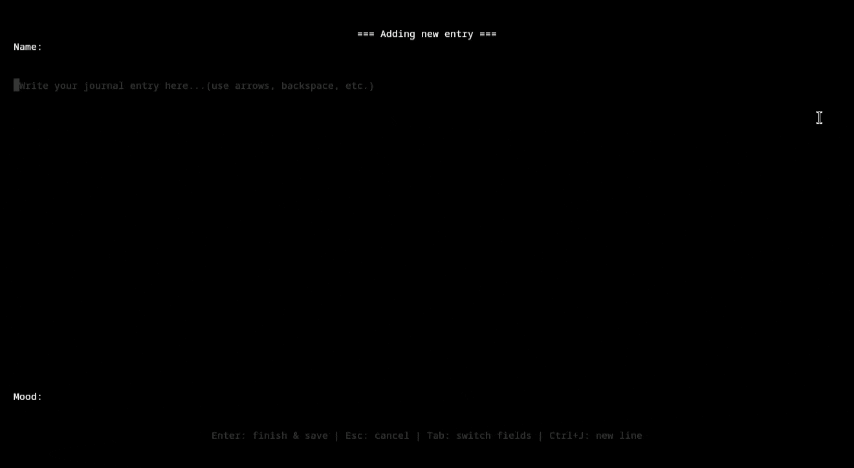

## journal

real journal is a actual journal cli with tui not like those other cli's, i made this for learning rust, and i did my best so far in this project.

## installation

### Prerequisites
- [Rust and Cargo](https://rustup.rs/) (installs `cargo` and `rustc`)

### how to install
```bash
git clone https://github.com/KishaWeb/real_journal.git
cd real_journal
cargo install --path .
```
## usage
ok i hadnt so far made it a full cli you still have to run it in cargo so here are the commands:
```bash
journal help
``` 
this shows the usage and commands
```bash
journal add <name> <description> <mood> or journal add (this would open a tui to add a journal)
``` 
adds a journal (including the time it was made thats on your system)
```bash
journal list
``` 
shows the list of journals with their index's
```bash
journal show <name>
``` 
shows the journal with the name you put in
```bash
journal remove <index> , <index>...
``` 
removes the index you chose (dont chose the name of the journal)
```bash
journal edit <index>
``` 
edits the requsted index

```bash
journal tui
``` 
opens the tui

## showcase
### tui:


### quick journal:

